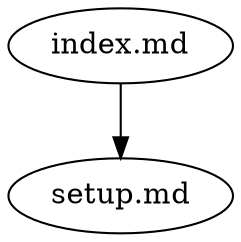

# drft

A structural integrity checker for linked file systems. drft treats a directory of files as a dependency graph -- files are nodes, links are edges -- and validates the graph against configurable rules.

## Install

```bash
cargo install drft-cli    # via Cargo
npm install -g drft-cli   # via npm
```

Or download a prebuilt binary from [GitHub Releases](https://github.com/johnmdonahue/drft-cli/releases).

The binary is called `drft`.

## Quick start

```bash
# Check a directory for issues (no setup required)
drft check

# Initialize a config file
drft init

# Snapshot the current state
drft lock

# Check for staleness (files changed since last lock)
drft check

# Verify lockfile is current (for CI)
drft lock --check
```

## What it does

drft discovers files, runs configurable parsers to extract links between them, and builds a dependency graph. It then validates that graph against a set of rules:

| Rule | Description |
|------|-------------|
| `dangling-edge` | Edge target does not exist |
| `directed-cycle` | Circular dependency detected |
| `directory-edge` | Edge points to a directory, not a file |
| `stale` | Dependency changed since last lock |
| `boundary-violation` | Edge escapes the graph boundary |
| `encapsulation-violation` | Edge reaches into a child graph's non-interface files |
| `orphan-node` | Node has no inbound edges |
| `symlink-edge` | Edge target is a symlink |
| `fragility` | Structural single point of failure |
| `fragmentation` | Disconnected graph component |
| `layer-violation` | Edge violates depth hierarchy |
| `redundant-edge` | Edge is transitively redundant |
| `schema-violation` | Node metadata violates schema (requires options) |

All rules default to `warn`. Override to `error` for CI enforcement or `off` to suppress.

See the [full documentation](docs/README.md) for details on parsers, analyses, and rules.

## Commands

### `drft check`

Validate the graph against all enabled rules.

```bash
drft check                    # check current directory
drft check -C path/to/docs   # check a different directory
drft check --recursive        # include child graphs
drft check --rule orphan-node  # run only specific rules
drft check --watch            # re-check on file changes
drft check --format json      # machine-readable output
```

### `drft lock`

Snapshot file hashes to `drft.lock`. This enables staleness detection -- when a file changes, its dependents are flagged.

```bash
drft lock                     # create/update drft.lock
drft lock --check             # verify lockfile is current (CI)
drft lock --recursive         # lock all graphs bottom-up
```

### `drft parse`

Show raw parser output — what edges each parser found, before graph construction.

```bash
drft parse                    # all parsers, text output
drft parse --parser markdown  # only the markdown parser
drft parse --format json      # machine-readable output
```

### `drft graph`

Export the dependency graph.

```bash
drft graph                    # JSON Graph Format output
drft graph --dot              # GraphViz DOT output
drft graph --recursive        # include child graphs
```

### `drft impact`

Show what depends on the given files (transitively), sorted by review priority. Each dependent is annotated with its depth from the changed file, impact radius (its own transitive dependents), and betweenness centrality.

```bash
drft impact setup.md              # text output
drft impact --format json setup.md  # JSON with structural context
drft impact config.md faq.md      # multiple files
```

### `drft report`

Query structural analyses of the graph — degree, betweenness, SCC, depth, and more.

```bash
drft report                       # all analyses, text output
drft report degree                # single analysis
drft report betweenness pagerank  # multiple analyses
drft report --format json degree  # machine-readable output
```

See [analyses documentation](docs/analyses/README.md) for the full list.

### `drft init`

Create a default `drft.toml` config file.

```bash
drft init                     # write default drft.toml
```

## Configuration

`drft.toml` in the graph root:

```toml
# Which paths become File nodes (default: ["*.md"])
include = ["*.md", "*.yaml"]

# Remove from the graph (also respects .gitignore)
exclude = ["drafts/*", "archive/*"]

# Public interface — nodes accessible from parent graphs.
# Presence of this section enables encapsulation.
[interface]
nodes = ["overview.md", "api/*.md"]

# Parsers — edge extraction from File nodes
[parsers.markdown]
files = ["*.md"]                   # restrict to .md files (default: all)

[parsers.tsx]                      # custom (has command)
files = ["*.tsx"]
command = "./scripts/parse-tsx-links.sh"

# Rule severities: "error", "warn", or "off"
# Table form for per-rule options or custom rules
[rules]
dangling-edge = "error"
directed-cycle = "error"
stale = "error"

[rules.orphan-node]
severity = "warn"
ignore = ["README.md", "CLAUDE.md"]

[rules.max-fan-out]
command = "./scripts/max-fan-out.sh"
severity = "warn"

[rules.max-fan-out.options]            # rule-specific options (passed through)
threshold = 5
```

drft automatically respects `.gitignore`.

## Graph nesting

A directory with a `drft.toml` or `drft.lock` becomes a **graph**. Child directories with their own config are **child graphs** -- they appear as `Graph` nodes in the parent graph and are checked independently.

```
project/
  drft.lock              # root graph
  drft.toml
  index.md
  docs/
    overview.md
  research/
    drft.toml            # child graph (Graph node in parent)
    drft.lock
    overview.md
    internal.md
```

Use `--recursive` to check or lock all graphs in one command. Use `[interface]` in `drft.toml` to declare a graph's public interface and control which files are visible to the parent.

## Output

Text format (default):

```
error[dangling-edge]: index.md -> gone.md (file not found)
error[stale]: index.md (stale via setup.md)
warn[directed-cycle]: cycle detected: a.md -> b.md -> c.md -> a.md
```

JSON format (`--format json`):

```json
{"rule":"dangling-edge","severity":"error","source":"index.md","target":"gone.md","message":"file not found","fix":"gone.md does not exist -- either create it or update the link in index.md"}
```

Every JSON diagnostic includes a `fix` field with actionable instructions.

DOT format (`drft graph --dot`) for graph export:



Graph JSON follows the [JSON Graph Format](https://github.com/jsongraph/json-graph-specification) specification.

## Exit codes

| Code | Meaning |
|------|---------|
| 0 | Clean (warnings may be present) |
| 1 | Rule violations at `error` severity, or `lock --check` found lockfile out of date |
| 2 | Usage or configuration error |

## Custom rules

Custom rules are scripts that receive the dependency graph as JSON on stdin and emit diagnostics as newline-delimited JSON on stdout:

```toml
[rules.max-fan-out]
command = "./scripts/max-fan-out.sh"
severity = "warn"
```

```sh
#!/bin/sh
# Flag nodes with more than 5 outbound links
python3 -c "
import json, sys
data = json.load(sys.stdin)
for node, count in ...:
    print(json.dumps({'message': '...', 'node': node, 'fix': '...'}))
"
```

See [examples/custom-rules](examples/custom-rules/drft.toml) for complete examples.

**Security note:** Custom rules and custom parsers execute arbitrary shell commands defined in `drft.toml`. Review the `[rules]` and `[parsers]` sections before running `drft` in untrusted repositories, the same as you would review npm scripts or Makefiles.

## LLM integration

drft is designed to work with LLMs as both a validation tool during editing sessions and a CI gate.

### JSON output

All commands support `--format json`. The `check` command returns a summary envelope:

```json
{
  "status": "warn",
  "total": 2,
  "errors": 0,
  "warnings": 2,
  "diagnostics": [
    {
      "rule": "stale",
      "severity": "warn",
      "message": "stale via",
      "node": "design.md",
      "via": "observations.md",
      "fix": "observations.md has changed — review design.md to ensure it still accurately reflects observations.md, then run drft lock"
    }
  ]
}
```

Every diagnostic includes a `fix` field with actionable instructions an LLM can follow directly.

### Impact analysis

After editing a file, check what depends on it:

```bash
drft impact src/main.rs --format json
```

```json
{
  "files": ["src/main.rs"],
  "total": 2,
  "impacted": [
    {
      "node": "docs/analyses/degree.md",
      "via": "src/main.rs",
      "depth": 1,
      "impact_radius": 4,
      "betweenness": 0.01,
      "fix": "..."
    },
    {
      "node": "README.md",
      "via": "docs/analyses/degree.md",
      "depth": 2,
      "impact_radius": 0,
      "betweenness": 0.005,
      "fix": "..."
    }
  ]
}
```

Results are sorted by review priority — high-radius nodes at shallow depth first. `impact_radius` tells you how many files cascade if you miss this one. `depth` tells you how far from the original change. `betweenness` signals structural centrality. The `fix` field provides actionable instructions.

This is the primary signal for LLM-assisted editing: after every file change, `drft impact` tells the agent exactly which files to review, in priority order.

### Claude Code hooks

Add to your project's `.claude/settings.json` to run `drft impact` automatically after file edits:

```json
{
  "hooks": {
    "PostToolUse": [
      {
        "matcher": "Edit|Write",
        "hooks": [
          {
            "type": "command",
            "command": "FILE=\"${TOOL_INPUT_FILE_PATH:-$TOOL_INPUT_file_path}\"; if [[ \"$FILE\" == *.md ]] || [[ \"$FILE\" == *.rs ]]; then npx drft impact \"$FILE\" --format json 2>/dev/null; fi"
          }
        ]
      }
    ]
  }
}
```

When the hook reports impacted files, the agent should read each one and verify its content still reflects the source. Extend the glob patterns (`*.md`, `*.rs`) to match the file types in your project.

If drft is installed globally (`cargo install drft-cli`), use `drft` instead of `npx drft`. For npm projects with `drft-cli` as a devDependency, `npx drft` ensures it resolves from `node_modules`.

### CI

```bash
npx drft check --recursive          # catch violations and staleness
npx drft lock --check --recursive   # verify lockfiles are committed
```

Run `check` first — it catches broken links, cycles, and stale files. Then `lock --check` verifies the lockfile is committed (structural consistency). Both exit with code 1 on failure.

The workflow: edit → `drft impact` (see what's affected) → review impacted files → fix impacts → `drft lock` (acknowledge the changes) → commit.

## License

MIT
