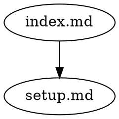

# drft

A structural integrity checker for markdown directories. drft treats a directory of markdown files as a dependency graph -- files are nodes, links are edges -- and validates the graph against configurable rules.

## Install

```bash
cargo install drft-cli    # via Cargo
npm install -g drft-cli   # via npm
```

Or download a prebuilt binary from [GitHub Releases](https://github.com/johnmdonahue/drft-cli/releases).

The binary is called `drft`.

## Quick start

```bash
# Check a directory for issues (no setup required)
drft check

# Initialize a config file
drft init

# Snapshot the current state
drft lock

# Check for staleness (files changed since last lock)
drft check

# Verify lockfile is current (for CI)
drft lock --check
```

## What it does

drft discovers markdown files, extracts links between them (inline, reference, image, autolink, frontmatter, wikilink), and builds a dependency graph. It then validates that graph against a set of rules:

| Rule | Default | Description |
|------|---------|-------------|
| `broken-link` | warn | Link target does not exist |
| `cycle` | warn | Circular dependency detected |
| `directory-link` | warn | Link points to a directory, not a file |
| `stale` | warn | Dependency changed since last lock |
| `containment` | warn | Link escapes the scope boundary |
| `encapsulation` | warn | Link reaches into a sealed scope's non-manifest files |
| `orphan` | off | File has no inbound links |
| `indirect-link` | off | Link target is a symlink |

## Commands

### `drft check`

Validate the graph against all enabled rules.

```bash
drft check                    # check current directory
drft check -C path/to/docs   # check a different directory
drft check --recursive        # include child scopes
drft check --rule orphan      # run only specific rules
drft check --watch            # re-check on file changes
drft check --format json      # machine-readable output
```

### `drft lock`

Snapshot file hashes and the dependency graph to `drft.lock`. This enables staleness detection -- when a file changes, its dependents are flagged.

```bash
drft lock                     # create/update drft.lock
drft lock --check             # verify lockfile is current (CI)
drft lock --recursive         # lock all scopes bottom-up
drft lock --manifest index.md # seal the scope with a manifest
```

### `drft graph`

Export the dependency graph.

```bash
drft graph                    # JSON Graph Format output
drft graph --format dot       # Graphviz DOT output
drft graph --recursive        # include child scope graphs
```

### `drft impact`

Show what depends on the given files (transitively).

```bash
drft impact setup.md              # text output
drft impact --format json setup.md  # JSON with fix instructions
drft impact config.md faq.md      # multiple files
```

### `drft init`

Create a default `drft.toml` config file.

## Configuration

`drft.toml` in the scope root:

```toml
# Glob patterns for files to exclude from discovery
ignore = ["drafts/*", "archive/*"]

# Rule severities: "error", "warn", or "off"
[rules]
broken-link = "error"
cycle = "error"
orphan = "warn"
stale = "warn"

# Per-rule path ignores
[ignore-rules]
orphan = ["README.md", "CLAUDE.md"]

# Custom rules (scripts that receive graph JSON on stdin)
[custom-rules.max-fan-out]
command = "./scripts/max-fan-out.sh"
severity = "warn"
```

drft automatically respects `.gitignore`.

## Scopes

A directory with a `drft.lock` becomes a **scope**. Child directories with their own `drft.lock` are **child scopes** -- they're checked independently with their own config.

```
project/
  drft.lock              # root scope
  drft.toml
  index.md
  docs/
    overview.md
  research/
    drft.lock            # child scope (frontier node in parent)
    drft.toml
    overview.md
    internal.md
```

Use `--recursive` to check or lock all scopes in one command. Use `--manifest` to seal a scope and control which files are visible to the parent.

## Output

Text format (default):

```
error[broken-link]: index.md -> gone.md (file not found)
warn[stale]: index.md (stale via setup.md)
warn[cycle]: cycle detected: a.md -> b.md -> c.md -> a.md
```

JSON format (`--format json`):

```json
{"rule":"broken-link","severity":"error","source":"index.md","target":"gone.md","message":"file not found","fix":"gone.md does not exist -- either create it or update the link in index.md"}
```

Every JSON diagnostic includes a `fix` field with actionable instructions.

DOT format (`--format dot`) for graph export:



Graph JSON follows the [JSON Graph Format](https://github.com/jsongraph/json-graph-specification) specification.

## Exit codes

| Code | Meaning |
|------|---------|
| 0 | Clean (warnings may be present) |
| 1 | Rule violations at `error` severity, or `lock --check` found lockfile out of date |
| 2 | Usage or configuration error |

## Custom rules

Custom rules are scripts that receive the dependency graph as JSON on stdin and emit diagnostics as newline-delimited JSON on stdout:

```toml
[custom-rules.max-fan-out]
command = "./scripts/max-fan-out.sh"
severity = "warn"
```

```sh
#!/bin/sh
# Flag nodes with more than 5 outbound links
python3 -c "
import json, sys
data = json.load(sys.stdin)
for node, count in ...:
    print(json.dumps({'message': '...', 'node': node, 'fix': '...'}))
"
```

See `examples/custom-rules/` for complete examples.

**Security note:** Custom rules execute arbitrary shell commands defined in `drft.toml`. Review the `[custom-rules]` section before running `drft check` in untrusted repositories, the same as you would review npm scripts or Makefiles.

## LLM integration

drft is designed to work with LLMs as both a validation tool during editing sessions and a CI gate.

### JSON output

All commands support `--format json`. The `check` command returns a summary envelope:

```json
{
  "status": "warn",
  "total": 2,
  "errors": 0,
  "warnings": 2,
  "diagnostics": [
    {
      "rule": "stale",
      "severity": "warn",
      "message": "stale via",
      "node": "design.md",
      "via": "observations.md",
      "fix": "observations.md has changed — review design.md to ensure it still accurately reflects observations.md, then run drft lock"
    }
  ]
}
```

Every diagnostic includes a `fix` field with actionable instructions an LLM can follow directly.

### Impact analysis

Before editing a file, check what depends on it:

```bash
drft impact observations.md --format json
```

```json
{
  "files": ["observations.md"],
  "total": 2,
  "impacted": [
    { "node": "problem-statement.md", "via": "observations.md", "fix": "..." },
    { "node": "design.md", "via": "problem-statement.md", "fix": "..." }
  ]
}
```

### Claude Code hooks

Add to `.claude/settings.json` to run drft automatically after markdown edits:

```json
{
  "hooks": {
    "PostToolUse": [
      {
        "matcher": "Edit|Write",
        "hooks": [
          {
            "type": "command",
            "command": "if [[ \"$TOOL_INPUT_FILE_PATH\" == *.md ]] || [[ \"$TOOL_INPUT_file_path\" == *.md ]]; then drft check --format json 2>/dev/null; fi"
          }
        ]
      }
    ]
  }
}
```

### CI

```bash
drft lock --check --recursive  # verify all lockfiles are current
drft check --recursive          # run all rules across all scopes
```

Both exit with code 1 on failure.

## License

MIT
